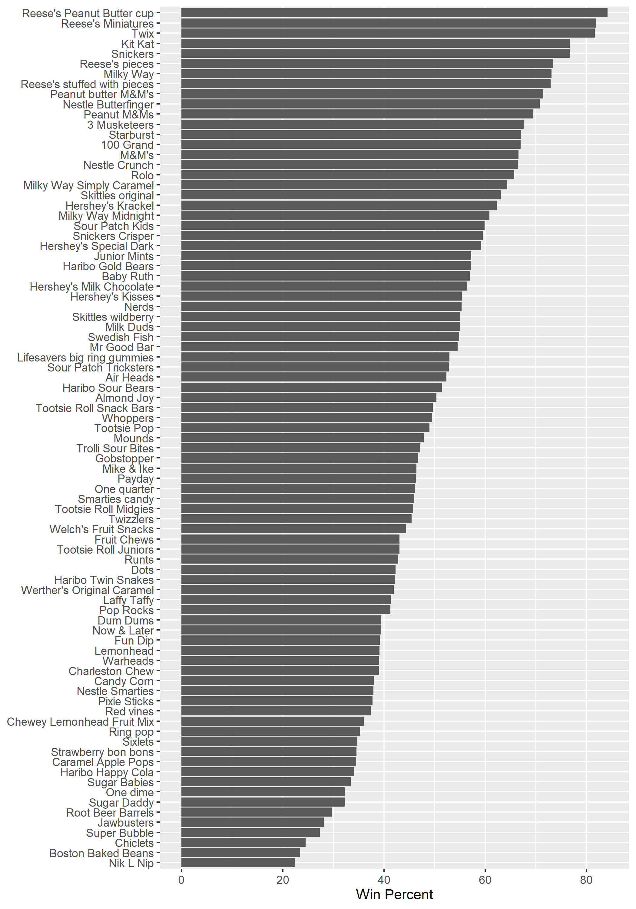

# Class 9: Halloween Mini-Project
Raquel Gonzalez (A16207442)

Here we analyze a candy dataset from the 538 website. This is a CSV file
from their GitHub repository.

## Data Import

``` r
candy <- read.csv("candy-data.csv", row.names = 1)
head(candy)
```

                 chocolate fruity caramel peanutyalmondy nougat crispedricewafer
    100 Grand            1      0       1              0      0                1
    3 Musketeers         1      0       0              0      1                0
    One dime             0      0       0              0      0                0
    One quarter          0      0       0              0      0                0
    Air Heads            0      1       0              0      0                0
    Almond Joy           1      0       0              1      0                0
                 hard bar pluribus sugarpercent pricepercent winpercent
    100 Grand       0   1        0        0.732        0.860   66.97173
    3 Musketeers    0   1        0        0.604        0.511   67.60294
    One dime        0   0        0        0.011        0.116   32.26109
    One quarter     0   0        0        0.011        0.511   46.11650
    Air Heads       0   0        0        0.906        0.511   52.34146
    Almond Joy      0   1        0        0.465        0.767   50.34755

> Q1: How many different candy types are in this dataset?

``` r
nrow(candy)
```

    [1] 85

There are 85 different candy types in this dataset

> Q2: How many fruity candy types are in the dataset?

``` r
sum(candy$fruity)
```

    [1] 38

There are 38 fruity candy types in the dataset.

## Data Exploration

> Q3: What is your favorite candy in the dataset and what is its
> `winpercent` value?

``` r
candy["Sour Patch Kids",]$winpercent
```

    [1] 59.864

My favorite candy is Sour Patch Kids. Its win percent is 59.86%.

> Q4: What is the `winpercent` value for “Kit Kat”

``` r
candy["Kit Kat",]$winpercent
```

    [1] 76.7686

The win percent for Kit Kat is 76.77%

> Q5: What is the `winpercent` value for “Tootsie Roll Snack Bars”?

``` r
candy["Tootsie Roll Snack Bars",]$winpercent
```

    [1] 49.6535

The win percent for Tootsie Roll Snack Bars is 49.65%

> Q: What is the least liked candy in the dataset - lowest winpercent?

``` r
inds <- order(candy$winpercent)
head(candy[inds,])
```

                       chocolate fruity caramel peanutyalmondy nougat
    Nik L Nip                  0      1       0              0      0
    Boston Baked Beans         0      0       0              1      0
    Chiclets                   0      1       0              0      0
    Super Bubble               0      1       0              0      0
    Jawbusters                 0      1       0              0      0
    Root Beer Barrels          0      0       0              0      0
                       crispedricewafer hard bar pluribus sugarpercent pricepercent
    Nik L Nip                         0    0   0        1        0.197        0.976
    Boston Baked Beans                0    0   0        1        0.313        0.511
    Chiclets                          0    0   0        1        0.046        0.325
    Super Bubble                      0    0   0        0        0.162        0.116
    Jawbusters                        0    1   0        1        0.093        0.511
    Root Beer Barrels                 0    1   0        1        0.732        0.069
                       winpercent
    Nik L Nip            22.44534
    Boston Baked Beans   23.41782
    Chiclets             24.52499
    Super Bubble         27.30386
    Jawbusters           28.12744
    Root Beer Barrels    29.70369

The least liked candy is Nik L Nip with a win percent of 22.45%

``` r
library(skimr)
skim(candy)
```

|                                                  |       |
|:-------------------------------------------------|:------|
| Name                                             | candy |
| Number of rows                                   | 85    |
| Number of columns                                | 12    |
| \_\_\_\_\_\_\_\_\_\_\_\_\_\_\_\_\_\_\_\_\_\_\_   |       |
| Column type frequency:                           |       |
| numeric                                          | 12    |
| \_\_\_\_\_\_\_\_\_\_\_\_\_\_\_\_\_\_\_\_\_\_\_\_ |       |
| Group variables                                  | None  |

Data summary

**Variable type: numeric**

| skim_variable    | n_missing | complete_rate |  mean |    sd |    p0 |   p25 |   p50 |   p75 |  p100 | hist  |
|:-----------------|----------:|--------------:|------:|------:|------:|------:|------:|------:|------:|:------|
| chocolate        |         0 |             1 |  0.44 |  0.50 |  0.00 |  0.00 |  0.00 |  1.00 |  1.00 | ▇▁▁▁▆ |
| fruity           |         0 |             1 |  0.45 |  0.50 |  0.00 |  0.00 |  0.00 |  1.00 |  1.00 | ▇▁▁▁▆ |
| caramel          |         0 |             1 |  0.16 |  0.37 |  0.00 |  0.00 |  0.00 |  0.00 |  1.00 | ▇▁▁▁▂ |
| peanutyalmondy   |         0 |             1 |  0.16 |  0.37 |  0.00 |  0.00 |  0.00 |  0.00 |  1.00 | ▇▁▁▁▂ |
| nougat           |         0 |             1 |  0.08 |  0.28 |  0.00 |  0.00 |  0.00 |  0.00 |  1.00 | ▇▁▁▁▁ |
| crispedricewafer |         0 |             1 |  0.08 |  0.28 |  0.00 |  0.00 |  0.00 |  0.00 |  1.00 | ▇▁▁▁▁ |
| hard             |         0 |             1 |  0.18 |  0.38 |  0.00 |  0.00 |  0.00 |  0.00 |  1.00 | ▇▁▁▁▂ |
| bar              |         0 |             1 |  0.25 |  0.43 |  0.00 |  0.00 |  0.00 |  0.00 |  1.00 | ▇▁▁▁▂ |
| pluribus         |         0 |             1 |  0.52 |  0.50 |  0.00 |  0.00 |  1.00 |  1.00 |  1.00 | ▇▁▁▁▇ |
| sugarpercent     |         0 |             1 |  0.48 |  0.28 |  0.01 |  0.22 |  0.47 |  0.73 |  0.99 | ▇▇▇▇▆ |
| pricepercent     |         0 |             1 |  0.47 |  0.29 |  0.01 |  0.26 |  0.47 |  0.65 |  0.98 | ▇▇▇▇▆ |
| winpercent       |         0 |             1 | 50.32 | 14.71 | 22.45 | 39.14 | 47.83 | 59.86 | 84.18 | ▃▇▆▅▂ |

> Q6: Is there any variable/column that looks to be on a different scale
> to the majority of the other columns in the dataset?

The row `winpercent` looks to be on a different scale (much larger) to
the majority of the other columns in the dataset.

> Q7: What do you think a zero and one represent for the
> `candy$chocolate` column?

Zero and One represent True/False values. The candy gets a zero if it is
not chocolate (false) and a one if it is chocolate (true).

> Q8: Plot a histogram of winpercent values

``` r
library(ggplot2)
ggplot(candy, aes(winpercent)) +
  geom_histogram(bins = 15)
```


> Q9: Is the distribution of win percent values symmetrical?

The distribution of win percent values is skewed.

> Q10: Is the center of the distribution above or below 50%?

The center of distribution is below 50%

> Q11: On average is chocolate candy higher or lower ranked than fruit
> candy?

First, find all chocolate candy and their \$winpercent values.

Next, summarize these values into one number.

Then, do the same for fruity candy and compare the numbers.

``` r
mean(candy$winpercent[as.logical(candy$chocolate)])
```

    [1] 60.92153

``` r
mean(candy$winpercent[as.logical(candy$fruity)])
```

    [1] 44.11974

On average, chocolate candy is ranked higher than fruity candy (60.92%
\> 44.12%).

> Q12: Is this difference statistically significant?

``` r
t.test(candy$winpercent[as.logical(candy$chocolate)],candy$winpercent[as.logical(candy$fruity)])
```


        Welch Two Sample t-test

    data:  candy$winpercent[as.logical(candy$chocolate)] and candy$winpercent[as.logical(candy$fruity)]
    t = 6.2582, df = 68.882, p-value = 2.871e-08
    alternative hypothesis: true difference in means is not equal to 0
    95 percent confidence interval:
     11.44563 22.15795
    sample estimates:
    mean of x mean of y 
     60.92153  44.11974 

These results are statistically significant with a p-value of 2.87e-08.

## Overall Candy Rankings

> Q13: What are the five least liked candy types in this set?

``` r
library(dplyr)
```


    Attaching package: 'dplyr'

    The following objects are masked from 'package:stats':

        filter, lag

    The following objects are masked from 'package:base':

        intersect, setdiff, setequal, union

``` r
candy %>%
  arrange(winpercent) %>%
  head(5)
```

                       chocolate fruity caramel peanutyalmondy nougat
    Nik L Nip                  0      1       0              0      0
    Boston Baked Beans         0      0       0              1      0
    Chiclets                   0      1       0              0      0
    Super Bubble               0      1       0              0      0
    Jawbusters                 0      1       0              0      0
                       crispedricewafer hard bar pluribus sugarpercent pricepercent
    Nik L Nip                         0    0   0        1        0.197        0.976
    Boston Baked Beans                0    0   0        1        0.313        0.511
    Chiclets                          0    0   0        1        0.046        0.325
    Super Bubble                      0    0   0        0        0.162        0.116
    Jawbusters                        0    1   0        1        0.093        0.511
                       winpercent
    Nik L Nip            22.44534
    Boston Baked Beans   23.41782
    Chiclets             24.52499
    Super Bubble         27.30386
    Jawbusters           28.12744

The top 5 least liked candies are Nik L Nip, Boston Baked Beans,
Chiclets, Super Bubble, and Jawbusters.

> Q14: What are the top 5 all time favorite candy types out of this set?

``` r
candy %>%
  arrange(winpercent) %>%
  tail(5)
```

                              chocolate fruity caramel peanutyalmondy nougat
    Snickers                          1      0       1              1      1
    Kit Kat                           1      0       0              0      0
    Twix                              1      0       1              0      0
    Reese's Miniatures                1      0       0              1      0
    Reese's Peanut Butter cup         1      0       0              1      0
                              crispedricewafer hard bar pluribus sugarpercent
    Snickers                                 0    0   1        0        0.546
    Kit Kat                                  1    0   1        0        0.313
    Twix                                     1    0   1        0        0.546
    Reese's Miniatures                       0    0   0        0        0.034
    Reese's Peanut Butter cup                0    0   0        0        0.720
                              pricepercent winpercent
    Snickers                         0.651   76.67378
    Kit Kat                          0.511   76.76860
    Twix                             0.906   81.64291
    Reese's Miniatures               0.279   81.86626
    Reese's Peanut Butter cup        0.651   84.18029

The top 5 all time favorite candy types are Reese’s Peanut Butter Cup,
Reese’s Miniatures, Twix, Kit Kat, and Snickers.

> Q15: Make a first barplot of candy ranking based on winpercent values.

``` r
ggplot(candy, aes(winpercent, rownames(candy))) +
  geom_col()
```


> Q16: This is very ugly, use the `reorder()` function to get the bars
> sorted by `winpercent`?

``` r
ggplot(candy, aes(winpercent, reorder(rownames(candy), winpercent))) + 
  geom_col() + 
  labs(x = "Win Percent", y = NULL)
```


``` r
# Still ugly. Can we adjust the labels so we can read them better?
ggsave('barplot1.png', width = 7, height = 10)
```



You can insert any image using this markdown syntax. ``

Now let’s add color to our ggplot. We need to make a custom color
vector.

``` r
# Start with an all black vector of colors.
my_cols <- rep("black", nrow(candy))
my_cols[as.logical(candy$chocolate)] = "deeppink4"
my_cols[as.logical(candy$bar)] = "palevioletred3"
my_cols[as.logical(candy$fruity)] = "plum3"
```

``` r
ggplot(candy, aes(winpercent, reorder(rownames(candy), winpercent))) + 
  geom_col(fill = my_cols) + 
  labs(x = "Win Percent", y = NULL)
```


``` r
ggsave('barplot2.png', width = 7, height = 10)
```


> Q17: What is the worst ranked chocolate candy?

The worst ranked chocolate candy is Sixlets.

> Q18: What is the best ranked fruity candy?

The best ranked fruity candy is Starburst.

## Taking a look at pricepercent

``` r
candy$pricepercent
```

     [1] 0.860 0.511 0.116 0.511 0.511 0.767 0.767 0.511 0.325 0.325 0.511 0.511
    [13] 0.325 0.511 0.034 0.034 0.325 0.453 0.465 0.465 0.465 0.465 0.093 0.918
    [25] 0.918 0.918 0.511 0.511 0.511 0.116 0.104 0.279 0.651 0.651 0.325 0.511
    [37] 0.651 0.441 0.860 0.860 0.918 0.325 0.767 0.767 0.976 0.325 0.767 0.651
    [49] 0.023 0.837 0.116 0.279 0.651 0.651 0.651 0.965 0.860 0.069 0.279 0.081
    [61] 0.220 0.220 0.976 0.116 0.651 0.651 0.116 0.116 0.220 0.058 0.767 0.325
    [73] 0.116 0.755 0.325 0.511 0.011 0.325 0.255 0.906 0.116 0.116 0.313 0.267
    [85] 0.848

if we want to see what is a good candy to buy in terms of winpercent and
pricepercent, we can plot these two variables and then see the best
candy for the least amount of money.

``` r
ggplot(candy) + 
  aes(winpercent, pricepercent, label=rownames(candy)) +
  geom_point(col=my_cols) +
  geom_text()
```


To avoid the overplotting of all these labels we can use an add on
package called ggrepl.

``` r
library(ggrepel)
ggplot(candy) + 
  aes(winpercent, pricepercent, label=rownames(candy)) +
  geom_point(col=my_cols) +
  geom_text_repel()
```

    Warning: ggrepel: 29 unlabeled data points (too many overlaps). Consider
    increasing max.overlaps


Play with the `max.overlaps` parameter on `geom_text_repel`.

``` r
ggplot(candy) + 
  aes(winpercent, pricepercent, label=rownames(candy)) +
  geom_point(col=my_cols) +
  geom_text_repel(max.overlaps=5, col=my_cols, size = 3.3)
```

    Warning: ggrepel: 54 unlabeled data points (too many overlaps). Consider
    increasing max.overlaps


> Q19: Which candy type is the highest ranked in terms of winpercent for
> the least money - i.e. offers the most bang for your buck?

Reese’s miniatures have the highest `winpercent` for the lowest
`pricepercent`.

> Q20: What are the top 5 most expensive candy types in the dataset and
> of these which is the least popular?

``` r
ord <- order(candy$pricepercent, decreasing = TRUE)
head( candy[ord,c(11,12)], n=5 )
```

                             pricepercent winpercent
    Nik L Nip                       0.976   22.44534
    Nestle Smarties                 0.976   37.88719
    Ring pop                        0.965   35.29076
    Hershey's Krackel               0.918   62.28448
    Hershey's Milk Chocolate        0.918   56.49050

The top 5 most expensive candies are Nik L Nip, Nestle Smarties, Ring
pop, Hershey’s Krackel, and Hershey’s Milk Chocolate. The least popular
of these is Nik L Nip.

# 5 Exploring the correlation structure.

``` r
library(corrplot)
```

    corrplot 0.92 loaded

``` r
cij <- cor(candy)
corrplot(cij)
```


> Q22: Examining this plot what two variables are anti-correlated
> (i.e. have minus values)?

Fruity and chocolate are two variables that are anticorrelated.

> Q23: Similarly, what two variables are most positively correlated?

Chocolate and winpercent are the two variables that are the most
positively correlated.

# On to PCA

The main function for this is called `prcom()` and here we know we need
to scale our data with the `scale=TRUE` argument.

``` r
pca <- prcomp(candy, scale=TRUE)
summary(pca)
```

    Importance of components:
                              PC1    PC2    PC3     PC4    PC5     PC6     PC7
    Standard deviation     2.0788 1.1378 1.1092 1.07533 0.9518 0.81923 0.81530
    Proportion of Variance 0.3601 0.1079 0.1025 0.09636 0.0755 0.05593 0.05539
    Cumulative Proportion  0.3601 0.4680 0.5705 0.66688 0.7424 0.79830 0.85369
                               PC8     PC9    PC10    PC11    PC12
    Standard deviation     0.74530 0.67824 0.62349 0.43974 0.39760
    Proportion of Variance 0.04629 0.03833 0.03239 0.01611 0.01317
    Cumulative Proportion  0.89998 0.93832 0.97071 0.98683 1.00000

``` r
my_data <- cbind(candy, pca$x[,1:3])
```

``` r
ggplot(my_data) +
  aes(PC1, PC2, label = rownames(candy)) +
  geom_point(col=my_cols) +
  geom_text_repel(col=my_cols) +
  labs(title="PCA Candy Space Map", subtitle = "Colored by type: chocolate bar (pink), chocolate other (burgundy), fruity (lavender), other (black)", caption= "Data from 538")
```

    Warning: ggrepel: 34 unlabeled data points (too many overlaps). Consider
    increasing max.overlaps


## Loadings Plot

``` r
loadings <- as.data.frame(pca$rotation)

ggplot(loadings) +
  aes(PC1, reorder(rownames(loadings), PC1)) +
  geom_col()
```


> Q24: What original variables are picked up strongly by PC1 in the
> positive direction? Do these make sense to you?

The fruity, pluribus, and hard variables are picked up strongly by PC1
in the positive direction. This makes sense, as these variables are all
correlated with each other, whereas the remaining variables in the
negative direction are all correlated with each other.
