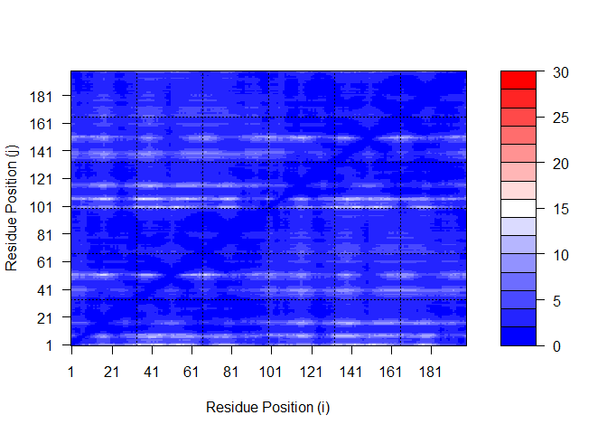

# Structural Bioinformatics (pt.2)
Raquel Gonzalez (A16207442)

AlphaFold has changed the game for protein structure prediction and
allows anyone with sufficient bioinformatics skills to predict the
structure of virtually any protein.

We ran AlphaFold via GoogleColab at:
https://github.com/sokrypton/ColabFold

In particular we used their AlphaFold2_mmseq2 version that uses mmseq2
rather than HMMMer for sequence search.

The main outputs include a set of **PDB structure files** along with
matching **JSON format files** that tell us how good the resulting
models might be.

Let’s start by loading the PDB structures up in Mol\*

``` r
# Change this for YOUR results dir name
results_dir <- "hivpr1dimer_23119" 

pdb_files <- list.files(path=results_dir, 
                        pattern="*.pdb", 
                        full.names=TRUE)

# Print our PDB file names
basename(pdb_files)
```

    [1] "hivpr1dimer_23119_unrelaxed_rank_001_alphafold2_multimer_v3_model_1_seed_000.pdb"
    [2] "hivpr1dimer_23119_unrelaxed_rank_002_alphafold2_multimer_v3_model_5_seed_000.pdb"
    [3] "hivpr1dimer_23119_unrelaxed_rank_003_alphafold2_multimer_v3_model_4_seed_000.pdb"
    [4] "hivpr1dimer_23119_unrelaxed_rank_004_alphafold2_multimer_v3_model_2_seed_000.pdb"
    [5] "hivpr1dimer_23119_unrelaxed_rank_005_alphafold2_multimer_v3_model_3_seed_000.pdb"

``` r
library(bio3d)

# Read all data from Models and superpose/fit coordinates
pdbs <- pdbaln(pdb_files, fit=TRUE, exefile="msa")
```

    Reading PDB files:
    hivpr1dimer_23119/hivpr1dimer_23119_unrelaxed_rank_001_alphafold2_multimer_v3_model_1_seed_000.pdb
    hivpr1dimer_23119/hivpr1dimer_23119_unrelaxed_rank_002_alphafold2_multimer_v3_model_5_seed_000.pdb
    hivpr1dimer_23119/hivpr1dimer_23119_unrelaxed_rank_003_alphafold2_multimer_v3_model_4_seed_000.pdb
    hivpr1dimer_23119/hivpr1dimer_23119_unrelaxed_rank_004_alphafold2_multimer_v3_model_2_seed_000.pdb
    hivpr1dimer_23119/hivpr1dimer_23119_unrelaxed_rank_005_alphafold2_multimer_v3_model_3_seed_000.pdb
    .....

    Extracting sequences

    pdb/seq: 1   name: hivpr1dimer_23119/hivpr1dimer_23119_unrelaxed_rank_001_alphafold2_multimer_v3_model_1_seed_000.pdb 
    pdb/seq: 2   name: hivpr1dimer_23119/hivpr1dimer_23119_unrelaxed_rank_002_alphafold2_multimer_v3_model_5_seed_000.pdb 
    pdb/seq: 3   name: hivpr1dimer_23119/hivpr1dimer_23119_unrelaxed_rank_003_alphafold2_multimer_v3_model_4_seed_000.pdb 
    pdb/seq: 4   name: hivpr1dimer_23119/hivpr1dimer_23119_unrelaxed_rank_004_alphafold2_multimer_v3_model_2_seed_000.pdb 
    pdb/seq: 5   name: hivpr1dimer_23119/hivpr1dimer_23119_unrelaxed_rank_005_alphafold2_multimer_v3_model_3_seed_000.pdb 

``` r
pdbs
```

                                   1        .         .         .         .         50 
    [Truncated_Name:1]hivpr1dime   PQITLWQRPLVTIKIGGQLKEALLDTGADDTVLEEMSLPGRWKPKMIGGI
    [Truncated_Name:2]hivpr1dime   PQITLWQRPLVTIKIGGQLKEALLDTGADDTVLEEMSLPGRWKPKMIGGI
    [Truncated_Name:3]hivpr1dime   PQITLWQRPLVTIKIGGQLKEALLDTGADDTVLEEMSLPGRWKPKMIGGI
    [Truncated_Name:4]hivpr1dime   PQITLWQRPLVTIKIGGQLKEALLDTGADDTVLEEMSLPGRWKPKMIGGI
    [Truncated_Name:5]hivpr1dime   PQITLWQRPLVTIKIGGQLKEALLDTGADDTVLEEMSLPGRWKPKMIGGI
                                   ************************************************** 
                                   1        .         .         .         .         50 

                                  51        .         .         .         .         100 
    [Truncated_Name:1]hivpr1dime   GGFIKVRQYDQILIEICGHKAIGTVLVGPTPVNIIGRNLLTQIGCTLNFP
    [Truncated_Name:2]hivpr1dime   GGFIKVRQYDQILIEICGHKAIGTVLVGPTPVNIIGRNLLTQIGCTLNFP
    [Truncated_Name:3]hivpr1dime   GGFIKVRQYDQILIEICGHKAIGTVLVGPTPVNIIGRNLLTQIGCTLNFP
    [Truncated_Name:4]hivpr1dime   GGFIKVRQYDQILIEICGHKAIGTVLVGPTPVNIIGRNLLTQIGCTLNFP
    [Truncated_Name:5]hivpr1dime   GGFIKVRQYDQILIEICGHKAIGTVLVGPTPVNIIGRNLLTQIGCTLNFP
                                   ************************************************** 
                                  51        .         .         .         .         100 

                                 101        .         .         .         .         150 
    [Truncated_Name:1]hivpr1dime   QITLWQRPLVTIKIGGQLKEALLDTGADDTVLEEMSLPGRWKPKMIGGIG
    [Truncated_Name:2]hivpr1dime   QITLWQRPLVTIKIGGQLKEALLDTGADDTVLEEMSLPGRWKPKMIGGIG
    [Truncated_Name:3]hivpr1dime   QITLWQRPLVTIKIGGQLKEALLDTGADDTVLEEMSLPGRWKPKMIGGIG
    [Truncated_Name:4]hivpr1dime   QITLWQRPLVTIKIGGQLKEALLDTGADDTVLEEMSLPGRWKPKMIGGIG
    [Truncated_Name:5]hivpr1dime   QITLWQRPLVTIKIGGQLKEALLDTGADDTVLEEMSLPGRWKPKMIGGIG
                                   ************************************************** 
                                 101        .         .         .         .         150 

                                 151        .         .         .         .       198 
    [Truncated_Name:1]hivpr1dime   GFIKVRQYDQILIEICGHKAIGTVLVGPTPVNIIGRNLLTQIGCTLNF
    [Truncated_Name:2]hivpr1dime   GFIKVRQYDQILIEICGHKAIGTVLVGPTPVNIIGRNLLTQIGCTLNF
    [Truncated_Name:3]hivpr1dime   GFIKVRQYDQILIEICGHKAIGTVLVGPTPVNIIGRNLLTQIGCTLNF
    [Truncated_Name:4]hivpr1dime   GFIKVRQYDQILIEICGHKAIGTVLVGPTPVNIIGRNLLTQIGCTLNF
    [Truncated_Name:5]hivpr1dime   GFIKVRQYDQILIEICGHKAIGTVLVGPTPVNIIGRNLLTQIGCTLNF
                                   ************************************************ 
                                 151        .         .         .         .       198 

    Call:
      pdbaln(files = pdb_files, fit = TRUE, exefile = "msa")

    Class:
      pdbs, fasta

    Alignment dimensions:
      5 sequence rows; 198 position columns (198 non-gap, 0 gap) 

    + attr: xyz, resno, b, chain, id, ali, resid, sse, call

RMSD is a standard measure of structural distance between coordinate
sets. We can use the `rmsd()` function to calculate the RMSD between all
pairs models.

``` r
rd <- rmsd(pdbs, fit=T)
```

    Warning in rmsd(pdbs, fit = T): No indices provided, using the 198 non NA positions

``` r
range(rd)
```

    [1]  0.000 14.631

Draw a heatmap of these RMSD matrix values.

``` r
library(pheatmap)

colnames(rd) <- paste0("m",1:5)
rownames(rd) <- paste0("m",1:5)
pheatmap(rd)
```


Now lets plot the pLDDT values across all models. Recall that this
information is in the B-factor column of each model and that this is
stored in our aligned `pdbs` object as `pdbs$b` with a row per
structure/model.

``` r
# Read a reference PDB structure
pdb <- read.pdb("1hsg")
```

      Note: Accessing on-line PDB file

``` r
plotb3(pdbs$b[1,], typ="l", lwd=2, sse=pdb)
points(pdbs$b[2,], typ="l", col="red")
points(pdbs$b[3,], typ="l", col="blue")
points(pdbs$b[4,], typ="l", col="darkgreen")
points(pdbs$b[5,], typ="l", col="orange")
abline(v=100, col="gray")
```


We can improve the superposition/fitting of our models by finding the
most consistent “rigid core” common across all the models. For this we
will use the `core.find()` function:

``` r
core <- core.find(pdbs)
```

     core size 197 of 198  vol = 4578.336 
     core size 196 of 198  vol = 3931.103 
     core size 195 of 198  vol = 3709.727 
     core size 194 of 198  vol = 3496.014 
     core size 193 of 198  vol = 3302.428 
     core size 192 of 198  vol = 3146.468 
     core size 191 of 198  vol = 3048.959 
     core size 190 of 198  vol = 2970.348 
     core size 189 of 198  vol = 2893.007 
     core size 188 of 198  vol = 2831.818 
     core size 187 of 198  vol = 2774.499 
     core size 186 of 198  vol = 2728.035 
     core size 185 of 198  vol = 2704.937 
     core size 184 of 198  vol = 2701.97 
     core size 183 of 198  vol = 2715.897 
     core size 182 of 198  vol = 2809.84 
     core size 181 of 198  vol = 2888.937 
     core size 180 of 198  vol = 2967.269 
     core size 179 of 198  vol = 3036.243 
     core size 178 of 198  vol = 3066.274 
     core size 177 of 198  vol = 3096.82 
     core size 176 of 198  vol = 3056.401 
     core size 175 of 198  vol = 3014.755 
     core size 174 of 198  vol = 2974.999 
     core size 173 of 198  vol = 2898.037 
     core size 172 of 198  vol = 2810.159 
     core size 171 of 198  vol = 2747.518 
     core size 170 of 198  vol = 2684.42 
     core size 169 of 198  vol = 2620.339 
     core size 168 of 198  vol = 2550.863 
     core size 167 of 198  vol = 2492.567 
     core size 166 of 198  vol = 2422.963 
     core size 165 of 198  vol = 2358.901 
     core size 164 of 198  vol = 2298.277 
     core size 163 of 198  vol = 2235.903 
     core size 162 of 198  vol = 2171.006 
     core size 161 of 198  vol = 2093.544 
     core size 160 of 198  vol = 2029.129 
     core size 159 of 198  vol = 1950.943 
     core size 158 of 198  vol = 1881.001 
     core size 157 of 198  vol = 1801.491 
     core size 156 of 198  vol = 1728.877 
     core size 155 of 198  vol = 1660.022 
     core size 154 of 198  vol = 1586.134 
     core size 153 of 198  vol = 1532.702 
     core size 152 of 198  vol = 1460.171 
     core size 151 of 198  vol = 1399.236 
     core size 150 of 198  vol = 1333.893 
     core size 149 of 198  vol = 1271.731 
     core size 148 of 198  vol = 1219.48 
     core size 147 of 198  vol = 1175.987 
     core size 146 of 198  vol = 1138.462 
     core size 145 of 198  vol = 1102.108 
     core size 144 of 198  vol = 1049.627 
     core size 143 of 198  vol = 1014.047 
     core size 142 of 198  vol = 970.56 
     core size 141 of 198  vol = 929.163 
     core size 140 of 198  vol = 889.089 
     core size 139 of 198  vol = 846.653 
     core size 138 of 198  vol = 805.785 
     core size 137 of 198  vol = 775.019 
     core size 136 of 198  vol = 743.075 
     core size 135 of 198  vol = 715.68 
     core size 134 of 198  vol = 689.773 
     core size 133 of 198  vol = 660.314 
     core size 132 of 198  vol = 630.951 
     core size 131 of 198  vol = 597.191 
     core size 130 of 198  vol = 566.973 
     core size 129 of 198  vol = 532.874 
     core size 128 of 198  vol = 496.192 
     core size 127 of 198  vol = 463.167 
     core size 126 of 198  vol = 431.877 
     core size 125 of 198  vol = 408.848 
     core size 124 of 198  vol = 376.594 
     core size 123 of 198  vol = 362.36 
     core size 122 of 198  vol = 353.633 
     core size 121 of 198  vol = 331.501 
     core size 120 of 198  vol = 312.518 
     core size 119 of 198  vol = 286.715 
     core size 118 of 198  vol = 262.336 
     core size 117 of 198  vol = 245.109 
     core size 116 of 198  vol = 228.342 
     core size 115 of 198  vol = 210.366 
     core size 114 of 198  vol = 197.519 
     core size 113 of 198  vol = 179.392 
     core size 112 of 198  vol = 161.891 
     core size 111 of 198  vol = 148.359 
     core size 110 of 198  vol = 134.477 
     core size 109 of 198  vol = 121.261 
     core size 108 of 198  vol = 109.516 
     core size 107 of 198  vol = 103.031 
     core size 106 of 198  vol = 96.443 
     core size 105 of 198  vol = 88.455 
     core size 104 of 198  vol = 81.816 
     core size 103 of 198  vol = 74.88 
     core size 102 of 198  vol = 68.386 
     core size 101 of 198  vol = 65.937 
     core size 100 of 198  vol = 62.345 
     core size 99 of 198  vol = 58.836 
     core size 98 of 198  vol = 52.868 
     core size 97 of 198  vol = 47.796 
     core size 96 of 198  vol = 41.292 
     core size 95 of 198  vol = 33.831 
     core size 94 of 198  vol = 24.912 
     core size 93 of 198  vol = 18.912 
     core size 92 of 198  vol = 12.7 
     core size 91 of 198  vol = 7.35 
     core size 90 of 198  vol = 4.922 
     core size 89 of 198  vol = 3.421 
     core size 88 of 198  vol = 2.553 
     core size 87 of 198  vol = 1.917 
     core size 86 of 198  vol = 1.513 
     core size 85 of 198  vol = 1.201 
     core size 84 of 198  vol = 1.046 
     core size 83 of 198  vol = 0.922 
     core size 82 of 198  vol = 0.755 
     core size 81 of 198  vol = 0.668 
     core size 80 of 198  vol = 0.596 
     core size 79 of 198  vol = 0.549 
     core size 78 of 198  vol = 0.493 
     FINISHED: Min vol ( 0.5 ) reached

``` r
core.inds <- print(core, vol=0.5)
```

    # 79 positions (cumulative volume <= 0.5 Angstrom^3) 
      start end length
    1    10  25     16
    2    28  48     21
    3    53  94     42

``` r
xyz <- pdbfit(pdbs, core.inds, outpath="corefit_structures")
```

Now we can examine the RMSF between positions of the structure. RMSF is
an often used measure of conformational variance along the structure:

``` r
rf <- rmsf(xyz)

plotb3(rf, sse=pdb)
abline(v=100, col="gray", ylab="RMSF")
```


If the predicted model has more than one domain, each domain may have
high confidence, yet the relative positions of the domains may not. The
estimated reliability of relative domain positions is in graphs of
predicted aligned error (PAE) which are included in the downloadable zip
file and analyzed in R above.

## Predicted Alignment Error for Domains

``` r
library(jsonlite)
```

    Warning: package 'jsonlite' was built under R version 4.3.3

``` r
# Listing of all PAE JSON files
pae_files <- list.files(path=results_dir,
                        pattern=".*model.*\\.json",
                        full.names = TRUE)
```

For example purposes lets read the 1st and 5th files (you can read the
others and make similar plots).

``` r
pae1 <- read_json(pae_files[1],simplifyVector = TRUE)
pae5 <- read_json(pae_files[5],simplifyVector = TRUE)

attributes(pae1)
```

    $names
    [1] "plddt"   "max_pae" "pae"     "ptm"     "iptm"   

``` r
# Per-residue pLDDT scores 
#  same as B-factor of PDB..
head(pae1$plddt) 
```

    [1] 87.81 92.00 91.81 91.88 94.25 88.00

The maximum PAE values are useful for ranking models. Here we can see
that model 5 is much worse than model 1. The lower the PAE score the
better. How about the other models, what are thir max PAE scores?

``` r
pae1$max_pae
```

    [1] 14.09375

``` r
pae5$max_pae
```

    [1] 29.29688

We can plot the N by N (where N is the number of residues) PAE scores
with ggplot or with functions from the Bio3D package:

``` r
plot.dmat(pae1$pae, 
          xlab="Residue Position (i)",
          ylab="Residue Position (j)")
```


``` r
plot.dmat(pae5$pae, 
          xlab="Residue Position (i)",
          ylab="Residue Position (j)",
          grid.col = "black",
          zlim=c(0,30))
```


We should really plot all of these using the same z range. Here is the
model 1 plot again but this time using the same data range as the plot
for model 5:

``` r
plot.dmat(pae1$pae, 
          xlab="Residue Position (i)",
          ylab="Residue Position (j)",
          grid.col = "black",
          zlim=c(0,30))
```



# Residue Conservation from Alignment File

``` r
aln_file <- list.files(path=results_dir,
                       pattern=".a3m$",
                        full.names = TRUE)
aln_file
```

    [1] "hivpr1dimer_23119/hivpr1dimer_23119.a3m"

``` r
aln <- read.fasta(aln_file[1], to.upper = TRUE)
```

    [1] " ** Duplicated sequence id's: 101 **"
    [2] " ** Duplicated sequence id's: 101 **"

How many sequences are in this alignment

``` r
dim(aln$ali)
```

    [1] 5378  132

We can score residue conservation in the alignment with the `conserv()`
function.

``` r
sim <- conserv(aln)
plotb3(sim[1:99], sse=trim.pdb(pdb, chain="A"),
       ylab="Conservation Score")
```


