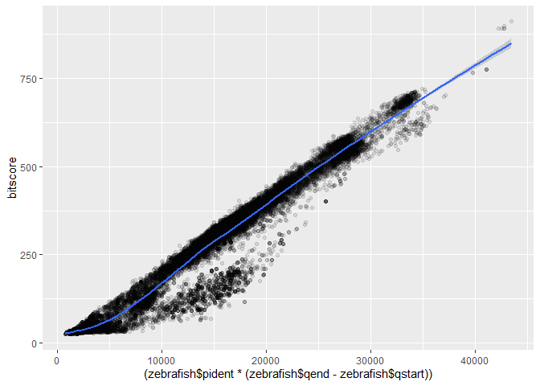

# Class 16: AWS Instance
Raquel Gonzalez (PID: A16207442)

``` r
zebrafish <- read.delim("C:mm-second.x.zebrafish.tsv")

colnames(zebrafish) <- c("qseqid", "sseqid", "pident", "length", "mismatch", "gapopen", "qstart", "qend", "sstart", "send", "evalue", "bitscore")
```

``` r
hist(zebrafish$bitscore, breaks = 30)
```


``` r
library(ggplot2)
ggplot(zebrafish, aes(pident, bitscore)) +
  geom_point(alpha=0.1)
```


``` r
ggplot(zebrafish, aes((zebrafish$pident * (zebrafish$qend - zebrafish$qstart)), bitscore)) + geom_point(alpha=0.1) + geom_smooth()
```

    Warning: Use of `zebrafish$pident` is discouraged.
    ℹ Use `pident` instead.

    Warning: Use of `zebrafish$qend` is discouraged.
    ℹ Use `qend` instead.

    Warning: Use of `zebrafish$qstart` is discouraged.
    ℹ Use `qstart` instead.

    Warning: Use of `zebrafish$pident` is discouraged.
    ℹ Use `pident` instead.

    Warning: Use of `zebrafish$qend` is discouraged.
    ℹ Use `qend` instead.

    Warning: Use of `zebrafish$qstart` is discouraged.
    ℹ Use `qstart` instead.

    `geom_smooth()` using method = 'gam' and formula = 'y ~ s(x, bs = "cs")'


