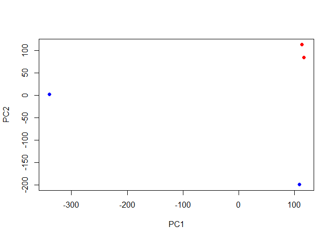
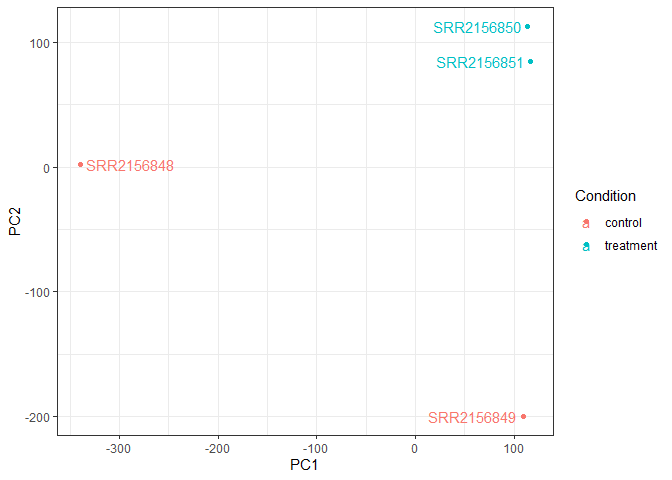

# Class 17
Raquel Gonzalez (PID:A16207442)

## Downstream Analysis

Import the transcript count estimates into R.

``` r
library(tximport)

# setup the folder and filenames to read
folders <- dir(pattern="SRR21568*")
samples <- sub("_quant", "", folders)
files <- file.path( folders, "abundance.h5" )
names(files) <- samples

txi.kallisto <- tximport(files, type = "kallisto", txOut = TRUE)
```

    1 2 3 4 

``` r
head(txi.kallisto$counts)
```

                    SRR2156848 SRR2156849 SRR2156850 SRR2156851
    ENST00000539570          0          0          0          0
    ENST00000576455          0          0          0          0
    ENST00000510508          0          0          0          0
    ENST00000474471          0          0          0          0
    ENST00000381700          0          0          0          0
    ENST00000445946          0          0          0          0

See how many transcript counts for each sample.

``` r
colSums(txi.kallisto$counts)
```

    SRR2156848 SRR2156849 SRR2156850 SRR2156851 
       2563611     598550     507926     448254 

See how many transcripts are detected in at least one sample.

``` r
sum(rowSums(txi.kallisto$counts)>0)
```

    [1] 88206

Filter out annotated transcripts with no reads and with no change over
the samples.

``` r
to.keep <- rowSums(txi.kallisto$counts) > 0
kset.nonzero <- txi.kallisto$counts[to.keep,]
```

``` r
keep2 <- apply(kset.nonzero,1,sd)>0
x <- kset.nonzero[keep2,]
```

## Principle Component Analysis

Apply any exploratory analysis technique to this counts matrix. Compute
the principal compenents, centering and scaling each transcript’s
measured levels so that each feature contributes equally to the PCA.

``` r
pca <- prcomp(t(x), scale=TRUE)
summary(pca)
```

    Importance of components:
                               PC1     PC2     PC3     PC4
    Standard deviation     226.574 140.854 130.464 1.22470
    Proportion of Variance   0.582   0.225   0.193 0.00002
    Cumulative Proportion    0.582   0.807   1.000 1.00000

Use the first two principle components as a co-ordinate system for
visualizing the summarized transcriptomic profiles of each sample.

``` r
plot(pca$x[,1], pca$x[,2],
     col=c("blue","blue","red","red"),
     xlab="PC1", ylab="PC2", pch=16)
```



``` r
library(ggplot2)
library(ggrepel)

# Make metadata object for the samples
colData <- data.frame(condition = factor(rep(c("control", "treatment"), each = 2)))
rownames(colData) <- colnames(txi.kallisto$counts)

# Make the data.frame for ggplot 
y <- as.data.frame(pca$x)
y$Condition <- as.factor(colData$condition)

ggplot(y) +
  aes(PC1, PC2, col=Condition) +
  geom_point() +
  geom_text_repel(label=rownames(y)) +
  theme_bw()
```



The plot makes it clear that PC1 separates the two control samples
(SRR2156848 and SRR2156849) from the two enhancer-targeting CRISPR-Cas9
samples (SRR2156850 and SRR2156851).

PC2 separates the two control samples from each other.

PC3 separates the two enhancer-targeting CRISPR samples from each other.

This could be investigated further to see which genes result in these
separation patterns. It is also at least slightly reassuring, implying
that there are considerable differences between the treated and control
sample
