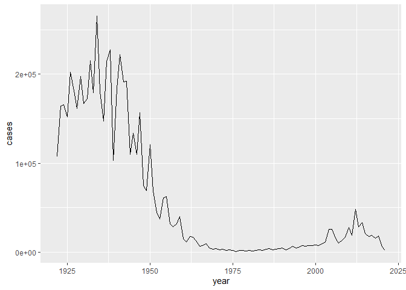
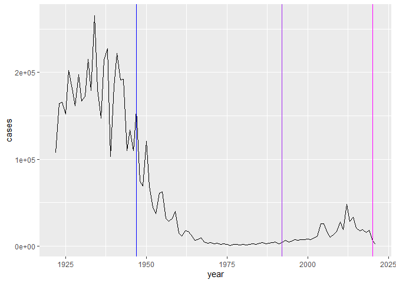
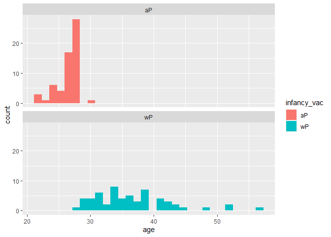
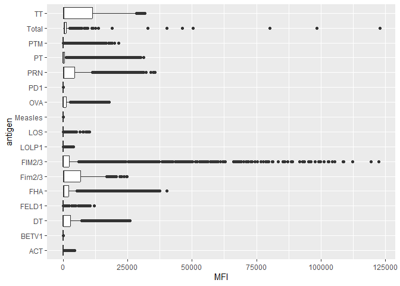
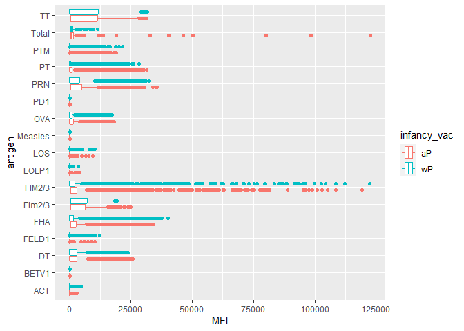
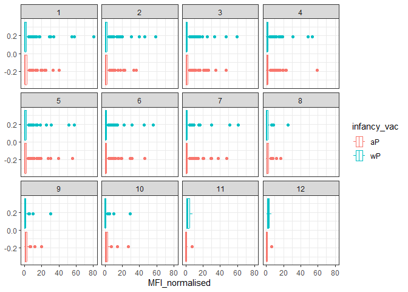
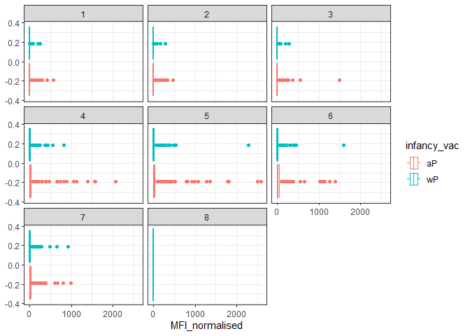
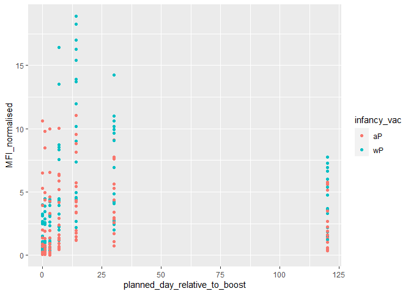
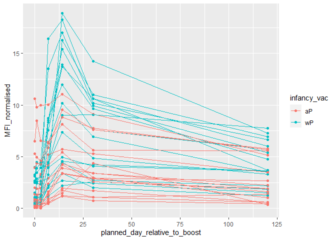
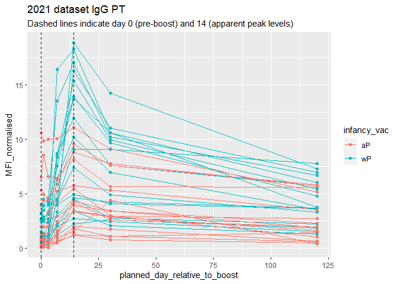

# Class 18: Pertussis Mini-Project
Raquel Gonzalez (A16207442)

First we will examine and explore Pertussis case numbers in the U.S. as
tracked by the CDC:
https://www.cdc.gov/pertussis/surv-reporting/cases-by-year.html

We can use the datapasta package to scrape this data from the website
into R:

``` r
cdc <- data.frame(year = c(1922L,1923L,1924L,1925L,
                                          1926L,1927L,1928L,1929L,1930L,1931L,
                                          1932L,1933L,1934L,1935L,1936L,
                                          1937L,1938L,1939L,1940L,1941L,1942L,
                                          1943L,1944L,1945L,1946L,1947L,
                                          1948L,1949L,1950L,1951L,1952L,
                                          1953L,1954L,1955L,1956L,1957L,1958L,
                                          1959L,1960L,1961L,1962L,1963L,
                                          1964L,1965L,1966L,1967L,1968L,1969L,
                                          1970L,1971L,1972L,1973L,1974L,
                                          1975L,1976L,1977L,1978L,1979L,1980L,
                                          1981L,1982L,1983L,1984L,1985L,
                                          1986L,1987L,1988L,1989L,1990L,
                                          1991L,1992L,1993L,1994L,1995L,1996L,
                                          1997L,1998L,1999L,2000L,2001L,
                                          2002L,2003L,2004L,2005L,2006L,2007L,
                                          2008L,2009L,2010L,2011L,2012L,
                                          2013L,2014L,2015L,2016L,2017L,2018L,
                                          
2019L,2020L,2021L),

cases = c(107473,164191,165418,152003,
                                          202210,181411,161799,197371,
                                          166914,172559,215343,179135,265269,
                                          180518,147237,214652,227319,103188,
                                          183866,222202,191383,191890,109873,
                                          133792,109860,156517,74715,69479,
                                          120718,68687,45030,37129,60886,
                                          62786,31732,28295,32148,40005,
                                          14809,11468,17749,17135,13005,6799,
                                          7717,9718,4810,3285,4249,3036,
                                          3287,1759,2402,1738,1010,2177,2063,
                                          1623,1730,1248,1895,2463,2276,
                                          3589,4195,2823,3450,4157,4570,
                                          2719,4083,6586,4617,5137,7796,6564,
                                          7405,7298,7867,7580,9771,11647,
                                          25827,25616,15632,10454,13278,
                                          16858,27550,18719,48277,28639,32971,
                                          20762,17972,18975,15609,18617,

6124,2116))
```

``` r
head(cdc)
```

      year  cases
    1 1922 107473
    2 1923 164191
    3 1924 165418
    4 1925 152003
    5 1926 202210
    6 1927 181411

> Q1: With the help of the R “addin” package datapasta assign the CDC
> pertussis case number data to a data frame called cdc and use ggplot
> to make a plot of cases numbers over time.

I want a plot of cases per year with ggplot.

``` r
library(ggplot2)
```

``` r
ggplot(cdc) +
  aes(year, cases) +
  geom_line()
```



> Q2. Using the ggplot geom_vline() function add lines to your previous
> plot for the 1946 introduction of the wP vaccine and the 1996 switch
> to aP vaccine (see example in the hint below). What do you notice?

``` r
ggplot(cdc) +
  aes(year, cases) +
  geom_line() +
  geom_vline(xintercept=1947, col="blue") +
  geom_vline(xintercept=1992, col="purple") +
  geom_vline(xintercept=2020, col="magenta")
```



> Q3. Describe what happened after the introduction of the aP vaccine?
> Do you have a possible explanation for the observed trend?

The number of cases reached a small peak after the introduction of the
aP vaccine potentially due to less efficacy of the vaccine, decreased
immunity, or the anti-vax movement that caused many to become more
apprehensive towards getting vaccinated. Let’s access data from the
CMI-PB project.

This database (like many modern projects) uses an API to return JSON
format data.

We will use the R package `jsonlite`.

``` r
library(jsonlite)
```

    Warning: package 'jsonlite' was built under R version 4.3.3

``` r
subject <- read_json("https://www.cmi-pb.org/api/subject", simplifyVector = TRUE) 
head(subject)
```

      subject_id infancy_vac biological_sex              ethnicity  race
    1          1          wP         Female Not Hispanic or Latino White
    2          2          wP         Female Not Hispanic or Latino White
    3          3          wP         Female                Unknown White
    4          4          wP           Male Not Hispanic or Latino Asian
    5          5          wP           Male Not Hispanic or Latino Asian
    6          6          wP         Female Not Hispanic or Latino White
      year_of_birth date_of_boost      dataset
    1    1986-01-01    2016-09-12 2020_dataset
    2    1968-01-01    2019-01-28 2020_dataset
    3    1983-01-01    2016-10-10 2020_dataset
    4    1988-01-01    2016-08-29 2020_dataset
    5    1991-01-01    2016-08-29 2020_dataset
    6    1988-01-01    2016-10-10 2020_dataset

> Q4: Q4. How many aP (the newer acellular vaccine) and wP (the older
> whole-cell vaccine) infancy vaccinated subjects are in the dataset?

``` r
sum(subject$infancy_vac == "wP")
```

    [1] 58

``` r
sum(subject$infancy_vac == "aP")
```

    [1] 60

``` r
table(subject$infancy_vac)
```


    aP wP 
    60 58 

There are 58 individuals with the wP vaccine and 60 individuals with the
aP vaccine.

> Q5. How many Male and Female subjects/patients are in the dataset?

``` r
table(subject$biological_sex)
```


    Female   Male 
        79     39 

There are 79 female subjects and 39 male patients.

> Q6. What is the breakdown of race and biological sex (e.g. number of
> Asian females, White males etc…)?

``` r
table(subject$race, subject$biological_sex)
```

                                               
                                                Female Male
      American Indian/Alaska Native                  0    1
      Asian                                         21   11
      Black or African American                      2    0
      More Than One Race                             9    2
      Native Hawaiian or Other Pacific Islander      1    1
      Unknown or Not Reported                       11    4
      White                                         35   20

# Side-Note: Working with Dates

We can use the `lubridate` package to ease the pain of doing math with
dates.

``` r
library(lubridate)
```

    Warning: package 'lubridate' was built under R version 4.3.3


    Attaching package: 'lubridate'

    The following objects are masked from 'package:base':

        date, intersect, setdiff, union

``` r
today()
```

    [1] "2024-03-14"

``` r
today() - ymd("2000-01-01")
```

    Time difference of 8839 days

``` r
today() - ymd("2002-8-19")
```

    Time difference of 7878 days

``` r
time_length(today() - mdy("8-19-2002"), "years")
```

    [1] 21.56879

> Q7. Using this approach determine (i) the average age of wP
> individuals, (ii) the average age of aP individuals; and (iii) are
> they significantly different?

``` r
# Use todays date to calculate age in days
subject$age <- today() - ymd(subject$year_of_birth)

library(dplyr)
```


    Attaching package: 'dplyr'

    The following objects are masked from 'package:stats':

        filter, lag

    The following objects are masked from 'package:base':

        intersect, setdiff, setequal, union

``` r
ap <- subject %>% filter(infancy_vac == "aP")

round( summary( time_length( ap$age, "years" ) ) )
```

       Min. 1st Qu.  Median    Mean 3rd Qu.    Max. 
         21      26      26      26      27      30 

``` r
# wP
wp <- subject %>% filter(infancy_vac == "wP")
round( summary( time_length( wp$age, "years" ) ) )
```

       Min. 1st Qu.  Median    Mean 3rd Qu.    Max. 
         28      31      36      37      39      56 

The average age of aP individuals is 26 years old. The average age of wP
individuals is 37 years old. These are significantly different.

> Q8. Determine the age of all individuals at time of boost?

``` r
subject$age <- time_length(today() - ymd(subject$year_of_birth), "years")

subject$age
```

      [1] 38.19849 56.19986 41.19918 36.19986 33.19918 36.19986 43.19781 39.19781
      [9] 28.19986 42.19849 38.19849 42.19849 27.19781 31.19781 35.19781 37.19918
     [17] 44.19986 27.19781 30.19849 43.19781 41.19918 39.19781 33.19918 32.19986
     [25] 36.19986 41.19918 27.19781 42.19849 27.19781 36.19986 35.19781 27.19781
     [33] 34.19849 41.19918 33.19918 27.19781 26.19849 27.19781 39.19781 30.19849
     [41] 39.19781 27.19781 26.19849 26.19849 27.19781 26.19849 28.19986 26.19849
     [49] 27.19781 27.19781 27.19781 26.19849 26.19849 27.19781 27.19781 27.19781
     [57] 28.19986 27.19781 27.19781 27.19781 37.19918 31.19781 29.19918 31.19781
     [65] 34.19849 48.19986 52.19986 52.19986 34.19849 26.19849 26.19849 33.19918
     [73] 29.19918 29.19918 26.19849 26.19849 36.19986 31.19781 37.19918 32.19986
     [81] 31.19781 26.19849 25.19918 27.19781 24.19986 26.19849 24.19986 24.19986
     [89] 27.19781 25.19918 26.19849 24.19986 28.19986 25.19918 26.19849 24.19986
     [97] 38.19849 31.19781 25.19918 23.19781 21.19918 21.19918 30.19849 35.19781
    [105] 30.19849 28.19986 26.19849 29.19918 35.19781 27.19781 28.19986 28.19986
    [113] 28.19986 34.19849 22.19849 24.19986 30.19849 26.19849

> Q9: With the help of a faceted boxplot or histogram (see below), do
> you think these two groups are significantly different?

``` r
ggplot(subject) +
  aes(age, fill=infancy_vac) +
  geom_histogram() +
  facet_wrap(vars(infancy_vac), nrow=2)
```

    `stat_bin()` using `bins = 30`. Pick better value with `binwidth`.



These groups are statistically different.

Get more data from CMI-PB

``` r
specimen <- read_json("https://www.cmi-pb.org/api/specimen", simplifyVector = T)
head(specimen)
```

      specimen_id subject_id actual_day_relative_to_boost
    1           1          1                           -3
    2           2          1                            1
    3           3          1                            3
    4           4          1                            7
    5           5          1                           11
    6           6          1                           32
      planned_day_relative_to_boost specimen_type visit
    1                             0         Blood     1
    2                             1         Blood     2
    3                             3         Blood     3
    4                             7         Blood     4
    5                            14         Blood     5
    6                            30         Blood     6

We need to **join** these two tables (subject and specimen) to make a
single new “meta” table with all our metadata. We will use the `dplyr`
join functions to do this.

``` r
library(dplyr)
```

> Q9. Join specimen and subject tables to make a new merged data frame
> containing all specimen records along with their associated subject
> details:

``` r
meta <- inner_join(subject, specimen)
```

    Joining with `by = join_by(subject_id)`

``` r
head(meta)
```

      subject_id infancy_vac biological_sex              ethnicity  race
    1          1          wP         Female Not Hispanic or Latino White
    2          1          wP         Female Not Hispanic or Latino White
    3          1          wP         Female Not Hispanic or Latino White
    4          1          wP         Female Not Hispanic or Latino White
    5          1          wP         Female Not Hispanic or Latino White
    6          1          wP         Female Not Hispanic or Latino White
      year_of_birth date_of_boost      dataset      age specimen_id
    1    1986-01-01    2016-09-12 2020_dataset 38.19849           1
    2    1986-01-01    2016-09-12 2020_dataset 38.19849           2
    3    1986-01-01    2016-09-12 2020_dataset 38.19849           3
    4    1986-01-01    2016-09-12 2020_dataset 38.19849           4
    5    1986-01-01    2016-09-12 2020_dataset 38.19849           5
    6    1986-01-01    2016-09-12 2020_dataset 38.19849           6
      actual_day_relative_to_boost planned_day_relative_to_boost specimen_type
    1                           -3                             0         Blood
    2                            1                             1         Blood
    3                            3                             3         Blood
    4                            7                             7         Blood
    5                           11                            14         Blood
    6                           32                            30         Blood
      visit
    1     1
    2     2
    3     3
    4     4
    5     5
    6     6

Now we can read some of the other data from CMI-PB.

``` r
ab_titer <- read_json("https://www.cmi-pb.org/api/plasma_ab_titer", simplifyVector = T)
head(ab_titer)
```

      specimen_id isotype is_antigen_specific antigen        MFI MFI_normalised
    1           1     IgE               FALSE   Total 1110.21154       2.493425
    2           1     IgE               FALSE   Total 2708.91616       2.493425
    3           1     IgG                TRUE      PT   68.56614       3.736992
    4           1     IgG                TRUE     PRN  332.12718       2.602350
    5           1     IgG                TRUE     FHA 1887.12263      34.050956
    6           1     IgE                TRUE     ACT    0.10000       1.000000
       unit lower_limit_of_detection
    1 UG/ML                 2.096133
    2 IU/ML                29.170000
    3 IU/ML                 0.530000
    4 IU/ML                 6.205949
    5 IU/ML                 4.679535
    6 IU/ML                 2.816431

> Q10. Now using the same procedure join meta with titer data so we can
> further analyze this data in terms of time of visit aP/wP, male/female
> etc.

One more `inner_join()` to add all our metadata in `meta` on to our
`ab_data` table:

``` r
abdata <- inner_join(ab_titer, meta)
```

    Joining with `by = join_by(specimen_id)`

``` r
head(abdata)
```

      specimen_id isotype is_antigen_specific antigen        MFI MFI_normalised
    1           1     IgE               FALSE   Total 1110.21154       2.493425
    2           1     IgE               FALSE   Total 2708.91616       2.493425
    3           1     IgG                TRUE      PT   68.56614       3.736992
    4           1     IgG                TRUE     PRN  332.12718       2.602350
    5           1     IgG                TRUE     FHA 1887.12263      34.050956
    6           1     IgE                TRUE     ACT    0.10000       1.000000
       unit lower_limit_of_detection subject_id infancy_vac biological_sex
    1 UG/ML                 2.096133          1          wP         Female
    2 IU/ML                29.170000          1          wP         Female
    3 IU/ML                 0.530000          1          wP         Female
    4 IU/ML                 6.205949          1          wP         Female
    5 IU/ML                 4.679535          1          wP         Female
    6 IU/ML                 2.816431          1          wP         Female
                   ethnicity  race year_of_birth date_of_boost      dataset
    1 Not Hispanic or Latino White    1986-01-01    2016-09-12 2020_dataset
    2 Not Hispanic or Latino White    1986-01-01    2016-09-12 2020_dataset
    3 Not Hispanic or Latino White    1986-01-01    2016-09-12 2020_dataset
    4 Not Hispanic or Latino White    1986-01-01    2016-09-12 2020_dataset
    5 Not Hispanic or Latino White    1986-01-01    2016-09-12 2020_dataset
    6 Not Hispanic or Latino White    1986-01-01    2016-09-12 2020_dataset
           age actual_day_relative_to_boost planned_day_relative_to_boost
    1 38.19849                           -3                             0
    2 38.19849                           -3                             0
    3 38.19849                           -3                             0
    4 38.19849                           -3                             0
    5 38.19849                           -3                             0
    6 38.19849                           -3                             0
      specimen_type visit
    1         Blood     1
    2         Blood     1
    3         Blood     1
    4         Blood     1
    5         Blood     1
    6         Blood     1

> Q11. How many specimens (i.e. entries in abdata) do we have for each
> isotype?

``` r
table(abdata$isotype)
```


     IgE  IgG IgG1 IgG2 IgG3 IgG4 
    6698 4255 8983 8990 8990 8990 

> Q12. What are the different \$dataset values in abdata and what do you
> notice about the number of rows for the most “recent” dataset?

``` r
table(abdata$dataset)
```


    2020_dataset 2021_dataset 2022_dataset 
           31520         8085         7301 

There is a signficantly smaller amount of data for the more recent
datasets.

Our first exploratory plot:

``` r
table(abdata$antigen)
```


        ACT   BETV1      DT   FELD1     FHA  Fim2/3  FIM2/3   LOLP1     LOS Measles 
       1970    1970    4168    1970    4562    1043    3125    1970    1970    1970 
        OVA     PD1     PRN      PT     PTM   Total      TT 
       4168    1970    4562    4562    1970     788    4168 

> Q13. Make a summary boxplot of Ab titer levels (MFI) for all antigens:

``` r
ggplot(abdata) +
  aes(MFI, antigen) +
  geom_boxplot()
```

    Warning: Removed 1 rows containing non-finite values (`stat_boxplot()`).



Can you facet or even just color by infancy_vac? Is there some
difference?

``` r
ggplot(abdata) +
  aes(MFI, antigen, col = infancy_vac) +
  geom_boxplot() 
```

    Warning: Removed 1 rows containing non-finite values (`stat_boxplot()`).



> Q14. What antigens show differences in the level of IgG antibody
> titers recognizing them over time? Why these and not others? Why are
> certain antigens and not others very variable in their detected levels
> here?

Different antigens have different proportions of the components within
the vaccine.

> Q15. Filter to pull out only two specific antigens for analysis and
> create a boxplot for each. You can chose any you like. Below I picked
> a “control” antigen (“OVA”, that is not in our vaccines) and a clear
> antigen of interest (“PT”, Pertussis Toxin, one of the key virulence
> factors produced by the bacterium B. pertussis) and the same for
> antigen==“FIM2/3”.

``` r
filter(abdata, antigen=="OVA") %>%
  ggplot() +
  aes(MFI_normalised, col=infancy_vac) +
  geom_boxplot(show.legend = T) +
  facet_wrap(vars(visit)) +
  theme_bw()
```



``` r
filter(abdata, antigen=="FIM2/3") %>%
  ggplot() +
  aes(MFI_normalised, col=infancy_vac) +
  geom_boxplot(show.legend = T ) +
  facet_wrap(vars(visit)) +
  theme_bw()
```



> Q16: What do you notice about these two antigens time courses and the
> PT data in particular?

The PT levels rise over time at a higher level compared to OVA. There is
a similar trend for where wP and aP subjects peak.

There are potentially some differences here, but in general it is hard
to tell with this whole dataset overview…

``` r
table(abdata$dataset)
```


    2020_dataset 2021_dataset 2022_dataset 
           31520         8085         7301 

Let’s focus in on just the 2021_dataset.

``` r
abdata.21 <- filter(abdata, dataset == "2021_dataset")
table(abdata.21$dataset)
```


    2021_dataset 
            8085 

Focus on PT antigen for IgG levels.

``` r
pt.21 <- filter(abdata.21, isotype == "IgG", antigen == "PT")
```

Plot of days (time) relative to boost vs MFI levels.

``` r
ggplot(pt.21) +
  aes(x=planned_day_relative_to_boost,
        y=MFI_normalised,
        col=infancy_vac) +
  geom_point()
```



``` r
ggplot(pt.21) +
  aes(x=planned_day_relative_to_boost,
        y=MFI_normalised,
        col=infancy_vac,
        group=subject_id) +
  geom_point() +
  geom_line()
```



``` r
ggplot(pt.21) +
  aes(x=planned_day_relative_to_boost,
        y=MFI_normalised,
        col=infancy_vac,
        group=subject_id) +
  geom_point() +
  geom_line() +
  geom_vline(xintercept=0, linetype="dashed") +
  geom_vline(xintercept=14, linetype="dashed") +
  labs(title="2021 dataset IgG PT",
       subtitle = "Dashed lines indicate day 0 (pre-boost) and 14 (apparent peak levels)")
```



> Q17: Do you see any clear difference in aP vs. wP responses?

The levels of MFI reach significantly higher peaks in wP individuals
compared to aP individuals at day 14. The levels are less distinct as
more time passes, with wP still showing higher MFI levels on average.
